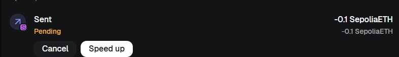
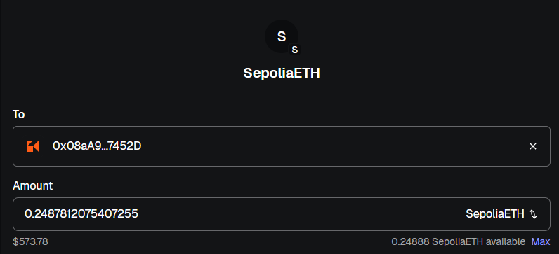

# Module 3

## Step 1

- I installed MetaMask as browser extenssion.
- Created new wallet by secret recovery phrase. (Saved 12 words localy)
- My metamask address: `0xBc2aE7643026a54FB1516ab353Aea7D2C700dbc8`

## Step 2   

- Connected Etherium Sepolia Testnet
- Received Google test ETH
- Mined `Sepolia PoW Faucet`
- [Transaction link](https://sepolia.etherscan.io/tx/0xaa21f2c84a3dc798d041ef8bf043c37cd2691ba5d5dd9236cf4b969eb2b7c575)

## Step 3

- Created additional new wallet with addres: `0x08aA9aeBD98ce3bdF8FF6A4E5cFC5E901247452D`
- Send from one to other test ETH [link](https://sepolia.etherscan.io/tx/0xf5004d05361f37944444b9248839d451f226f91dcadec381782d61ba8d635ec9)

## Step 4

- Send back withh low gas fee - [link](https://sepolia.etherscan.io/tx/0xd3d6eeb6f1ff2f5afbd29b622d738199bfceda81d3c3bb51eca75d7d183f6b00)
- Gas Price Low - `4.381632373 Gwei (0.000000004381632373 ETH)`

## Step 5

- Set for the first transaction nonce - 2.
  - 
- Set second as default. with maximum amount.
  - 
- Should sent second one and first one pending.
- Only after getting back all max ETH first sent.
- First tx [link](https://sepolia.etherscan.io/tx/0x5a71e5da5aadfd3652757e403d60b33668f6a0c6e33d1b42f7720c7da41edc4d)
- Second tx [link](https://sepolia.etherscan.io/tx/0x7d5cdcd7ab970698c83ed52afbbcfd64e3607ba1e1540de25ffceff348f1594c)
