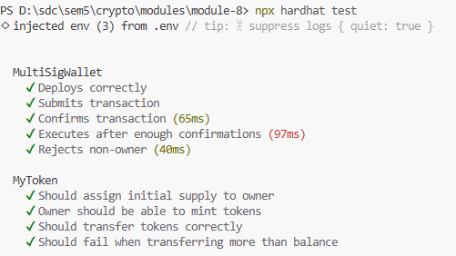

# Module 8

## 1. Contract Design and Multi-Signature Enforcement
### How multi-signature is enforced:

- An owner submits a transaction.
- Other owners confirm it.
- Each confirmation is recorded and counted.
- When `numConfirmations >= required`, the transaction can be executed.
- Only owners can submit, confirm, revoke, or execute transactions (access control via `onlyOwner`).

## 2. Deployment and Interaction

### Deployment:

The deployment script deploys:
- Logic contract (TokenV1) — contains business logic
- Proxy contract — stores state and delegates calls to the logic contract

Example:

```bash
npx hardhat run scripts/deploy.js
```

## 3. Security Considerations and Addressed Risks

### Implemented security measures:

- `onlyOwner` modifier restricts access to authorized users
- Prevents duplicate confirmations per owner
- Prevents execution before reaching required confirmations
- Uses `require()` checks for input validation
- Uses checks-effects-interactions pattern for safe ETH transfers

### Potential vulnerabilities:

- If an owner’s private key is compromised, attacker can participate in approvals
- No time delay (timelock) before execution
- No dynamic owner management (owners are fixed after deployment)

## 4. Purpose and Role of Multi-Signature Wallets

Multi-signature wallets improve security in decentralized systems by removing single points of failure.

Instead of one private key controlling funds, multiple parties must agree before execution.

This is especially important in:

- DAOs (decentralized governance)
- Crypto treasuries
- Team-managed funds

By requiring multiple approvals, multi-sig wallets reduce risks of theft, fraud, and human error, making them a key security mechanism in decentralized applications.

## Tests



In this project also added MyToken from previous module.
