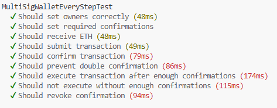

# Test Description

## Test passing screenshot:

## Description

## 1. `Should set owners correctly`

check after deploy if all adresses saves as owners

## 2. `Should set required confirmations`

checks if amount of  required approvals saves correctly 

## 3. `Should receive ETH`

checks if contract receives eth and balance increasing

## 4. `Should submit transaction`

check for creation new transaction using `submitTransaction()`

## 5. `Should confirm transaction`

checks if owner aprpoves

## 6. `Should prevent double confirmation`

checks if one owner couldn't do double appove 

## 7. `Should execute transaction after enough confirmations`

checks if transaction executes after reachiing enough approvals

## 8. `Should not execute without enough confirmations`

checks if transaction not executes if not enough approvals

## 9. `Should revoke confirmation`

checks if owner can cancel transaction
